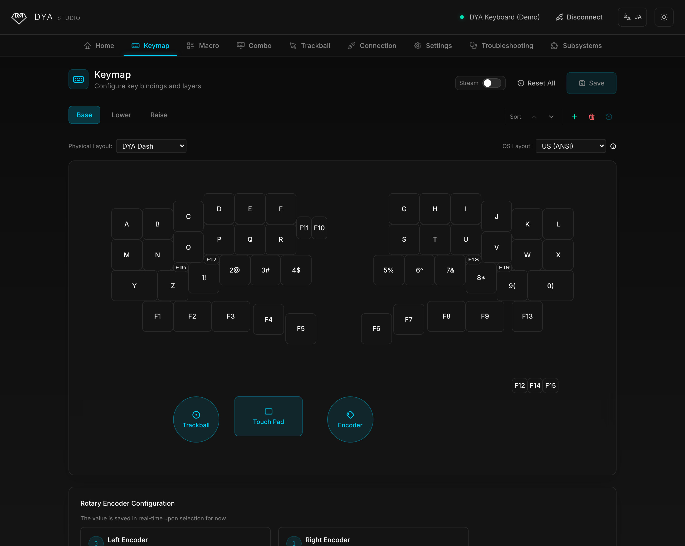
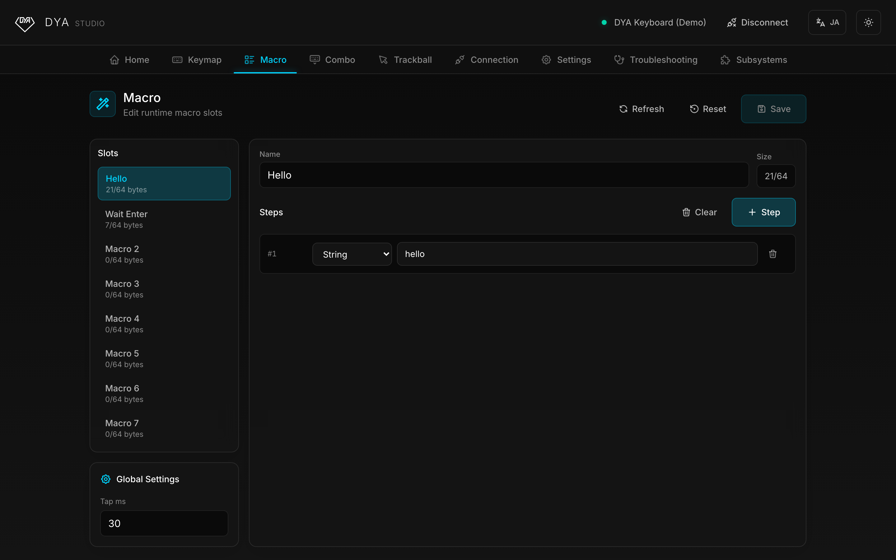
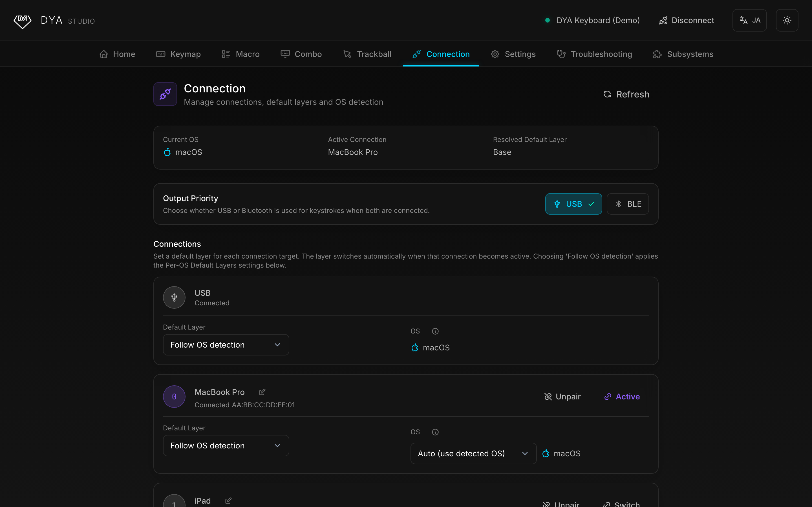
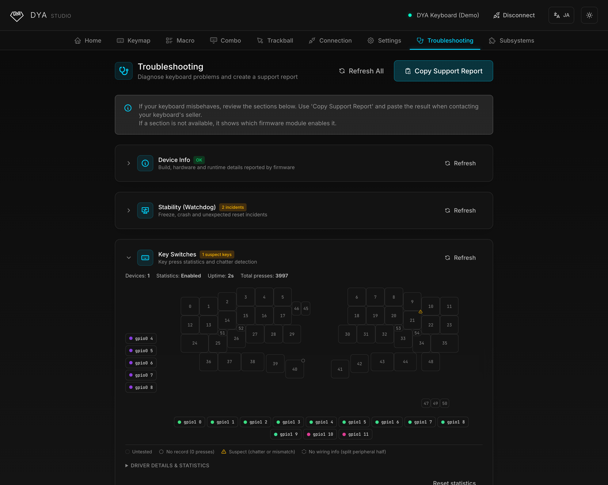

<h1 align="center">⌨️ Keeb-On! Studio</h1>

<p align="center">
  A web-based configuration tool for <strong>ClickBoard ErgoTrack</strong> and <strong>GoFortyMax</strong>.<br />
  Tune your keymap, trackpads and connections — right from your browser. No install required.
</p>

<p align="center">
  <sub>Hosted at <a href="https://keeb-on.studio">keeb-on.studio</a> — or run it locally, see <a href="#development">Development</a>.</sub>
  <br />
  <sub>No keyboard at hand? Hit the <em>Demo</em> button on the splash screen to explore every feature with a simulated keyboard.</sub>
</p>

> [!NOTE]
> **Keeb-On! Studio is a fork of [DYA Studio](https://github.com/cormoran/dya-studio) by [cormoran](https://github.com/cormoran) (cormoran707)**, licensed [AGPL-3.0](LICENSE). All credit for the original architecture, the ZMK Studio protocol extensions, and the vast majority of the feature set below belongs to that project. This fork exists to explore further UX changes and ship them under Hiroki's own brand; per the AGPL, this repository's full source (including all modifications) stays public. See [Attribution](#attribution) for details.

<p align="center">
  
</p>

## Getting Started

1. Run it locally for now (see [Development](#development) below) — no hosted URL yet.
2. Choose how to connect on the splash screen:
   - **USB** — plug in your keyboard and pick its serial port.
   - **Bluetooth** — pair and connect over BLE.
   - **Demo** — no device needed; explore the app with a simulated keyboard.
3. Configure away. Changes marked as unsaved can be saved to the keyboard's flash so they persist across reboots.

> [!TIP]
> The UI is available in **English** and **日本語** — use the language toggle in the top-right corner.

### Supported browsers

| Platform                                                                       | USB (Web Serial) | Bluetooth (Web Bluetooth) |
| ------------------------------------------------------------------------------ | ---------------- | ------------------------- |
| Chrome / Edge (desktop)                                                        | ✅               | ✅                        |
| Android (Chrome)                                                               | ❌               | ✅                        |
| iOS ([Bluefy](https://apps.apple.com/app/bluefy-web-ble-browser/id1492822055)) | ❌               | ✅                        |
| Firefox / Safari                                                               | ❌               | ❌                        |

## Features

### ⌨️ Keymap Editor

Edit key bindings and layers with a visual editor — equivalent to [ZMK Studio](https://zmk.studio/), with a slightly easier UI. Add, reorder, rename, and delete layers, and watch key presses stream live from the keyboard.

### 📋 Macros & Combos

Create and edit macros and combos at runtime, without rebuilding firmware.

<p align="center">
  
</p>

### 📶 Connection Management

Name, switch, and unpair BLE profiles. Choose whether USB or Bluetooth wins when both are connected. See which OS each host is detected as, override it per profile, and set a default layer per connection target or per OS — the keyboard switches layers automatically when you switch devices.

<p align="center">
  
</p>

### ⚙️ Device Settings

Tweak power management (idle and deep-sleep timeouts) for each half of the keyboard or all devices at once, and edit advanced firmware settings directly from the browser.

### 🩺 Troubleshooting & Diagnostics

Inspect battery levels, firmware build info, and uptime for both halves. Hunt down key chatter with the interactive key-switch diagnostics view, watch the trackball sensor's raw surface frames, and copy a full support report to share when asking for help.

<p align="center">
  
</p>

## Does it work with my keyboard?

**Only if it is a ClickBoard ErgoTrack or a GoFortyMax.** This is not a general
ZMK configurator: a keyboard that names itself as anything else is disconnected
as soon as it says so, rather than half-supported. Everything here — the
trackpad gestures, the per-OS layers, the battery readout, the firmware
downloads — is built against these two boards' firmware and would be wrong or
absent on another.

If you have a different ZMK keyboard, use **[DYA Studio](https://studio.dya.cormoran.works)**,
the project this one is forked from. It supports any ZMK Studio keyboard, and
it is where the architecture this fork depends on was written.

**No keyboard at hand?** The _Demo_ button on the splash screen opens a
simulated ErgoTrack with every feature live, including saving keymaps — the
part of the app people want before buying a board.

Configuration is **over USB**. The firmware ships with ZMK Studio's lock
disabled, and wireless configuration and a lockless keyboard cannot both exist:
ZMK stops advertising once a keyboard is bonded and connected, and the setting
that works around that only takes effect at the moment a lock is opened.

## Development

**Stack**: React 19, TypeScript, Vite, Tailwind CSS v4, Radix UI

```bash
git clone https://github.com/Salicylic-acid3/keeb-on-studio.git
cd keeb-on-studio
npm install
npm run dev            # Start dev server at http://localhost:5173
```

```bash
npm run build          # Production build
npm run lint           # Lint code
npm test               # Run tests
npm run test:coverage  # Test coverage
```

- [Development Guide](docs/DEVELOPMENT_GUIDE.md) — design system, component patterns, and implementation guidelines
- [Testing Guide](docs/TESTING_GUIDE.md) — testing patterns and examples

## Status & Roadmap

Live at [keeb-on.studio](https://keeb-on.studio), and in use on real hardware.

What this fork added on top of DYA Studio:

- **Narrowed to two keyboards.** Unsupported boards are turned away at connect;
  the tabs and settings that do not apply to ErgoTrack / GoFortyMax are gone
- **Trackpad work** — per-OS tuning, the pads drawn on the board, and an editor
  for the gestures (pinch, three-finger swipe) that names them instead of
  showing seven blank keys
- **Tap dance** and **battery level per half**, both as purpose-built ZMK
  modules published alongside this app
- **Keymaps you can keep**: named local saves, JSON export, link sharing, a
  public gallery, and printing
- **Firmware downloads** for both boards, straight from a release permalink
- **A continuous entry mode** for setting a run of keys without a dialog each
  time, and a one-action copy from Base to the per-OS Alt Base layer
- **Its own look** — hexagon and onsen-town palette, with DYA Studio credited
  in full rather than painted over

Still open:

- [ ] Acid Caps keycap legends: warn when a keymap needs a legend the set does
      not have (waiting on legend data for the three sets)
- [ ] Trackpad diagnostics — raw touch data and register values, which needs a
      Studio RPC added to the IQS9151 driver
- [ ] Product photos, specs and purchase links for both boards
- [ ] The "Abyss" cloud import/export tab talks to cormoran's own backend via an
      OAuth client id only valid for the upstream app — disabled here (no client
      id configured), and not planned

## Attribution

Keeb-On! Studio is a fork of **[DYA Studio](https://github.com/cormoran/dya-studio)**, created by **cormoran ([@cormoran707](https://x.com/cormoran707))**. The keymap/macro/combo editor, the ZMK Studio protocol client, the connection and diagnostics tooling, and the underlying "Custom Studio Protocol" extensions to ZMK are all upstream work, and this fork still rests on them — including cormoran's ZMK fork and the modules it loads. The work listed under [Status & Roadmap](#status--roadmap) is this fork's; the foundation it is built on is not.

Licensed under [AGPL-3.0](LICENSE), same as upstream — any modified version of this app made available over a network must offer its complete corresponding source, per the license's terms.

## Acknowledgments

[ZMK Firmware](https://zmk.dev/) • [ZMK Studio](https://zmk.studio/) • [Radix UI](https://www.radix-ui.com/) • [Tabler Icons](https://tabler.io/icons)
