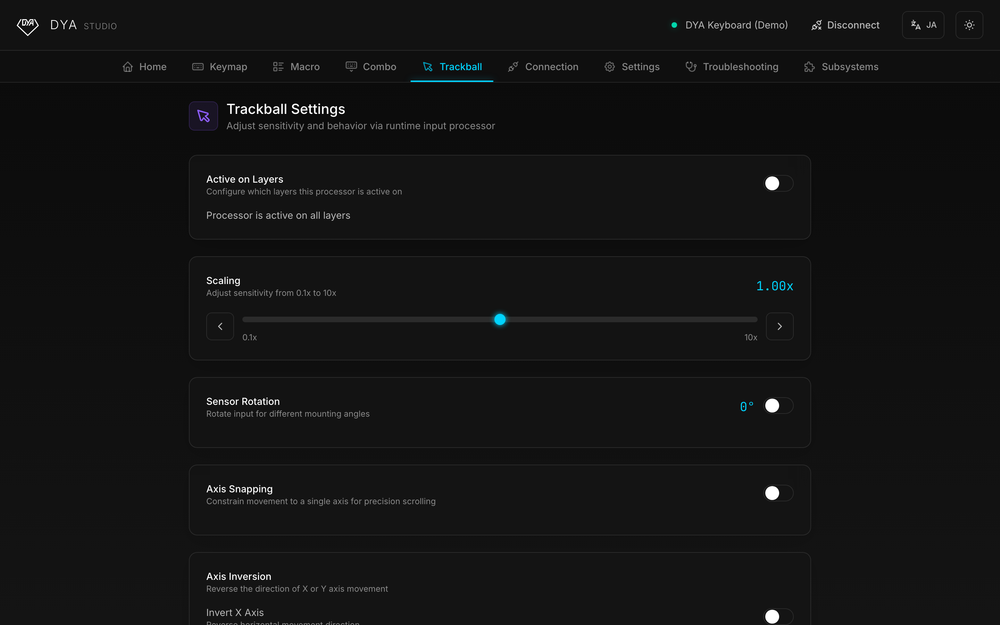

<h1 align="center">⌨️ Keeb-On! Studio</h1>

<p align="center">
  A web-based configuration tool for ZMK keyboards, built for people who found ZMK Studio (and its variants) harder to use than it should be.<br />
  Tune your keymap, trackball, and connections — right from your browser. No install required.
</p>

<p align="center">
  <sub>🚧 Not deployed yet — see <a href="#status--roadmap">Status &amp; Roadmap</a> below.</sub>
  <br />
  <sub>No keyboard at hand? Hit the <em>Demo</em> button on the splash screen to explore every feature with a simulated keyboard.</sub>
</p>

> [!NOTE]
> **Keeb-On! Studio is a fork of [DYA Studio](https://github.com/cormoran/dya-studio) by [cormoran](https://github.com/cormoran) (cormoran707)**, licensed [AGPL-3.0](LICENSE). All credit for the original architecture, the ZMK Studio protocol extensions, and the vast majority of the feature set below belongs to that project. This fork exists to explore further UX changes and ship them under Hiroki's own brand; per the AGPL, this repository's full source (including all modifications) stays public. See [Attribution](#attribution) for details.

<p align="center">
  
</p>

## Getting Started

1. Run it locally for now (see [Development](#development) below) — no hosted URL yet.
2. Choose how to connect on the splash screen:
   - **USB** — plug in your keyboard and pick its serial port.
   - **Bluetooth** — pair and connect over BLE.
   - **Demo** — no device needed; explore the app with a simulated keyboard.
3. Configure away. Changes marked as unsaved can be saved to the keyboard's flash so they persist across reboots.

> [!TIP]
> The UI is available in **English** and **日本語** — use the language toggle in the top-right corner.

### Supported browsers

| Platform                                                                       | USB (Web Serial) | Bluetooth (Web Bluetooth) |
| ------------------------------------------------------------------------------ | ---------------- | ------------------------- |
| Chrome / Edge (desktop)                                                        | ✅               | ✅                        |
| Android (Chrome)                                                               | ❌               | ✅                        |
| iOS ([Bluefy](https://apps.apple.com/app/bluefy-web-ble-browser/id1492822055)) | ❌               | ✅                        |
| Firefox / Safari                                                               | ❌               | ❌                        |

## Features

### ⌨️ Keymap Editor

Edit key bindings and layers with a visual editor — equivalent to [ZMK Studio](https://zmk.studio/), with a slightly easier UI. Add, reorder, rename, and delete layers, and watch key presses stream live from the keyboard.

### 📋 Macros & Combos

Create and edit macros and combos at runtime, without rebuilding firmware.

<p align="center">
  
</p>

### 🎯 Trackball Tuning

Adjust the embedded trackball in real time: pointer sensitivity (0.1×–10×), sensor rotation for different mounting angles, axis snapping, scroll behavior, and automatic layer switching — all per input processor, scoped to the layers you choose.

<p align="center">
  
</p>

### 📶 Connection Management

Name, switch, and unpair BLE profiles. Choose whether USB or Bluetooth wins when both are connected. See which OS each host is detected as, override it per profile, and set a default layer per connection target or per OS — the keyboard switches layers automatically when you switch devices.

<p align="center">
  
</p>

### ⚙️ Device Settings

Tweak power management (idle and deep-sleep timeouts) for each half of the keyboard or all devices at once, and edit advanced firmware settings directly from the browser.

### 🩺 Troubleshooting & Diagnostics

Inspect battery levels, firmware build info, and uptime for both halves. Hunt down key chatter with the interactive key-switch diagnostics view, watch the trackball sensor's raw surface frames, and copy a full support report to share when asking for help.

<p align="center">
  
</p>

## Does it work with my keyboard?

- **Any ZMK keyboard with [ZMK Studio](https://zmk.dev/docs/features/studio) enabled**: the keymap editor works out of the box.
- **DYA keyboards, and keyboards built on [cormoran's ZMK fork + modules](https://github.com/cormoran)**: everything above — trackball tuning, connection management, per-OS default layers, diagnostics, and more. See the [developer guide](https://studio.dya.cormoran.works/developer-guide) (upstream) for how to add support to your own board.

> [!WARNING]
> cormoran's ZMK fork is experimental and optimized for DYA keyboards. It may contain unstable or breaking changes — use it with other keyboards at your own risk.

Bringing this to Hiroki's own ClickBoard / GoForty lines means those boards' firmware moving onto ZMK + cormoran's Custom Studio Protocol modules first — see [Status & Roadmap](#status--roadmap).

## Development

**Stack**: React 19, TypeScript, Vite, Tailwind CSS v4, Radix UI

```bash
git clone <this-repo-url>   # TODO: set once pushed to Hiroki's own GitHub
cd keeb-on-studio
npm install
npm run dev            # Start dev server at http://localhost:5173
```

```bash
npm run build          # Production build
npm run lint           # Lint code
npm test               # Run tests
npm run test:coverage  # Test coverage
```

- [Development Guide](docs/DEVELOPMENT_GUIDE.md) — design system, component patterns, and implementation guidelines
- [Testing Guide](docs/TESTING_GUIDE.md) — testing patterns and examples

## Status & Roadmap

This fork was just started. So far: rebranded (name, colors — indigo/vermillion/gold/cream instead of the upstream cyan/green/purple "cybernetic" theme), confirmed the build and full test suite (83 suites / 688 tests) still pass unmodified. Not yet done, roughly in order:

- [ ] Decide on and apply real UX changes (the goal is "easier than ZMK Studio," not just a reskin — needs a concrete list of pain points to fix)
- [ ] Replace the placeholder DYA logo/favicon with Keeb-On! Studio's own mark
- [ ] Stand up a real repo (GitHub) and a hosting domain
- [ ] The "Abyss" cloud import/export tab talks to cormoran's own backend (`abyss.keyboard-hub.com`) via an OAuth client id that's only valid for the upstream app — it's already disabled in this fork (no client id configured) until/unless that's addressed separately
- [ ] Longer term, if ClickBoard/GoForty move to ZMK: build/adapt the cormoran-fork modules for those boards so this tool can actually configure them

## Attribution

Keeb-On! Studio is a fork of **[DYA Studio](https://github.com/cormoran/dya-studio)**, created by **cormoran ([@cormoran707](https://x.com/cormoran707))**. The keymap/macro/combo editor, the ZMK Studio protocol client, the trackball/connection/diagnostics tooling, and the underlying "Custom Studio Protocol" extensions to ZMK are all upstream work. This fork's changes so far are limited to branding (name, color palette); substantive feature work has not started.

Licensed under [AGPL-3.0](LICENSE), same as upstream — any modified version of this app made available over a network must offer its complete corresponding source, per the license's terms.

## Acknowledgments

[ZMK Firmware](https://zmk.dev/) • [ZMK Studio](https://zmk.studio/) • [Radix UI](https://www.radix-ui.com/) • [Tabler Icons](https://tabler.io/icons)
